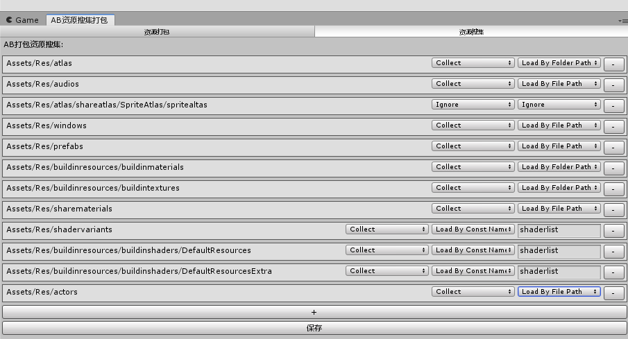
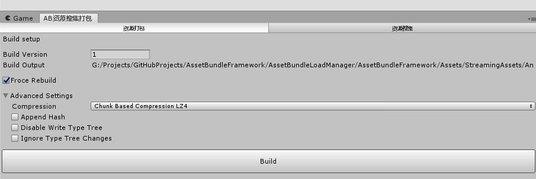
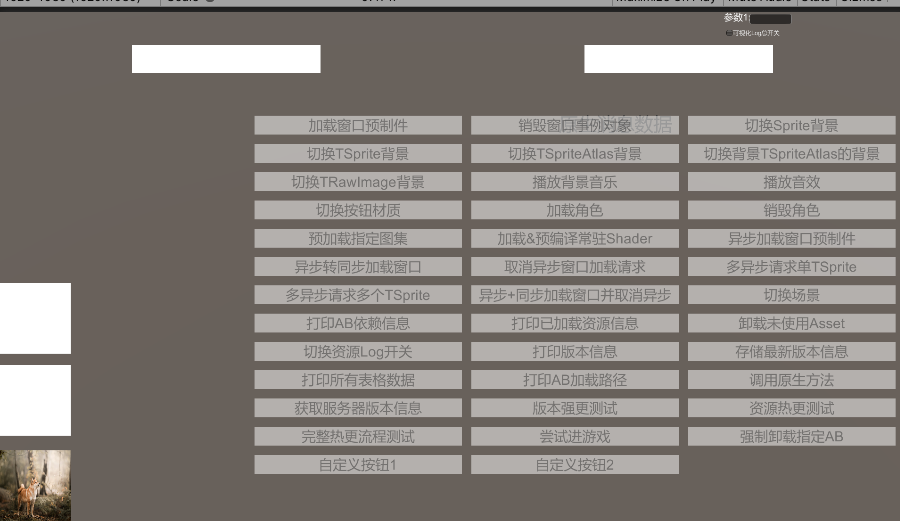
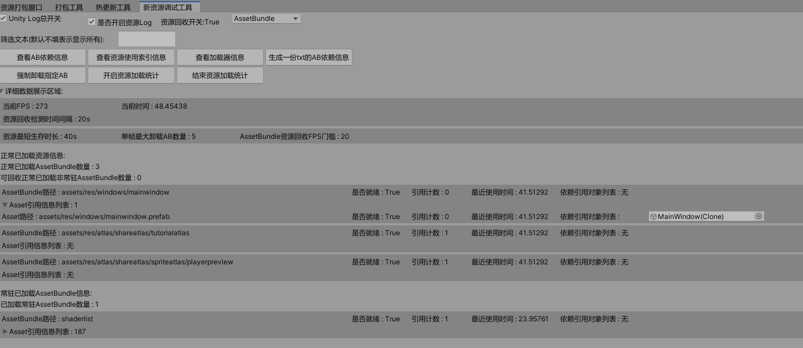
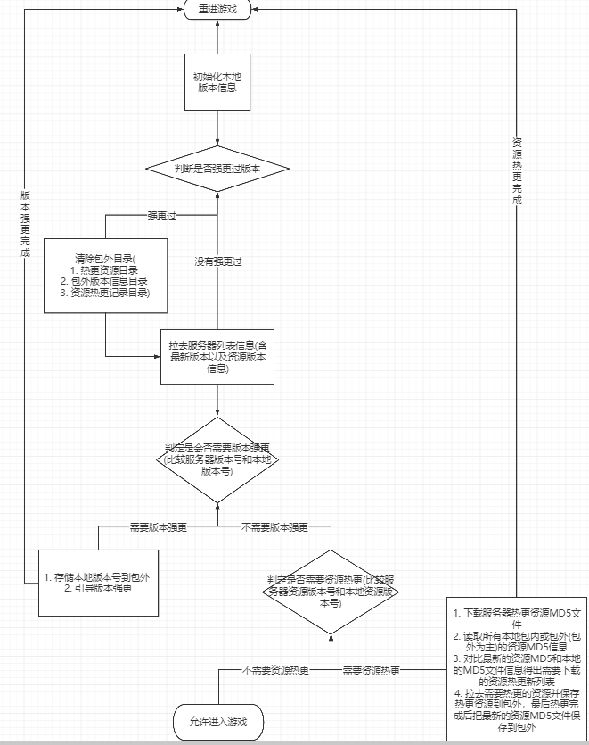
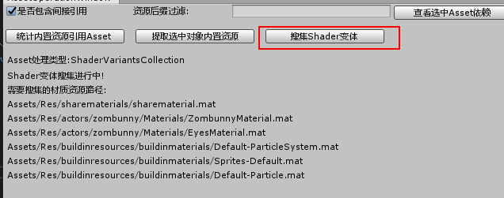

# 功能模块

**2021/12/7，新版资源加载管理打包框架初版正式完成。**


## 资源加载管理模块

基于索引计数+组件绑定的AssetBundle加载管理框架。(参考: tangzx/ABSystem思路)

### 功能支持

1. 支持编辑器和真机加载AssetBundle同步和异步加载(统一采用callback风格)
2. 设计上没有考虑支持Asset异步加载统一都是同步加载(AssetBundle.LoadAsset & AssetBundle.LoadAllAssets)
3. 支持三种基本的资源加载类型(NormalLoad -- 正常加载(可通过Tick检测判定正常卸载) Preload -- 预加载(切场景才会卸载) PermanentLoad -- 永久加载(常驻内存永不卸载))
4. 基于UnityEngine.Object的AB索引生命周期绑定
5. 底层统一管理AB索引计数，管理资源加载释放
6. 支持卸载频率，卸载帧率门槛，单次卸载数量等设置。采用Long Time Unused First Unload(越久没用越先卸载)原则卸载。
7. 支持最大AB异步加载携程数量配置(采用队列模式)
8. 支持编辑器下使用AssetDatabase模式(只需设置AB名字，无需打包AB，暂时只支持同步--**2021/4/21新版打包修改后不需要设置AB名字，直接采用全路径加载**)
9. 采用[AssetBundleBrowser](https://github.com/Unity-Technologies/AssetBundles-Browser)工具打包AB(**2021/4/21新版AB打包修改后不再采用**)

### 类说明

Manager统一管理：

    - ModuleManager(单例类 Manager of Manager的管理类)
    - ModuleInterface(模块接口类)

资源加载类：

    - ResourceLoadMethod(资源加载方式枚举类型 -- 同步 or 异步)
    - ResourceLoadMode(资源加载模式 -- AssetBundle or AssetDatabase(**限Editor模式下可切换，且当前仅支持同步加载方式，异步加载待支持**))
    - ResourceLoadState(资源加载状态 -- 错误，等待加载， 加载中，完成之类的)
    - ResourceLoadType(资源加载类型 -- 正常加载，预加载，永久加载)
    - ResourceModuleManager(资源加载模块统一入口管理类)
    - AbstractResourceModule(资源加载模块抽象)
    - AbstractResourceInfo(资源加载信息抽象)
    - AssetBundleModule(AssetBundle模式下的实际加载管理模块)
    - AssetBundleAsyncQueue(AB异步加载队列)
    - AssetBundleLoader(AB资源加载任务类)
    - AssetBundleInfo(AB信息以及加载状态类 -- AB访问，索引计数以及AB依赖关系抽象都在这一层)
    - AssetBundlePath(AB资源路径相关 -- 处理多平台以及热更资源加载路径问题)
    - ResourceDebugWindow.cs(Editor运行模式下可视化查看资源加载(AssetBundle和AssetDatabase两种都支持)详细信息的辅助工具窗口)
    - AssetDatabaseModule(AssetDatabase模式下的实际加载管理模块)
    - AssetDatabaseLoader(AssetDatabase模式下的资源加载任务类)
    - AssetDatabaseInfo(AssetDatabase模式下资源加载信息类)
    - ResourceConstData(资源打包加载相关常量数据)
    - ResourceLoadAnalyse(资源加载统计分析工具)

### AB加载管理方案

加载管理方案：

1. 加载指定资源
2. 加载自身AB(自身AB加载完通知资源加载层移除该AB加载任务避免重复的加载任务被创建)，自身AB加载完判定是否有依赖AB
3. 有则加载依赖AB(增加依赖AB的引用计数)(依赖AB采用和自身AB相同的加载方式(ResourceLoadMethod),但依赖AB统一采用ResourceLoadType.NormalLoad加载类型)
4. 自身AB和所有依赖AB加载完回调通知逻辑层可以开始加载Asset资源(AB绑定对象在这一步)
5. 判定AB是否满足引用计数为0，绑定对象为空，且为NormalLoad加载方式则卸载该AB(并释放依赖AB的计数减一)(通知资源管理层AB卸载，重用AssetBundleInfo对象)
6. 切场景，递归判定卸载PreloadLoad加载类型AB资源

相关设计：

1. 依赖AB与被依赖者采用同样的加载方式(ResourceLoadMethod)，但加载方式依赖AB统一采用ResourceLoadType.NormalLoad
2. 依赖AB通过索引计数管理，只要原始AB不被卸载，依赖AB就不会被卸载
3. 已加载的AB资源加载类型只允许从低往高变(NormalLoad -> Preload -> PermanentLoad)，不允许从高往低(PermanentLoad -> Preload -> NormalLoad)

#### Demo使用说明

**--------------------------2021/4/21重大更新即将来临-------------------------**

Note:

**2021/4/20新版AB打包工具重新开始编写，对后续加载接口也有影响，所以下面部分Demo展示以及热更新展示可能已经不是最新的了，新版AB打包还未完成，需要等待更新。**

**新版AB打包主要参考[MotionFramework](https://github.com/gmhevinci/MotionFramework)里的AB打包思路(所以拷贝了不少该作者的核心代码)，细节部分个人做了一些扩展，资源加载和打包部分修改完成(2021/5/5)，热更新相关部分还待修改。**

**主要变动如下:**

**1. 打包AB的策略由抽象的目录打包策略设定决定**

**2. 打包后的AB保留目录结构，确保AB模式和AssetDatabase模式加载都面向Asset路径保持一致性**

这里先简单的看下新的AB搜集和打包界面:





关于Asset路径与AB路径关联信息以及AB依赖信息最终都存在一个叫assetbundlebuildinfo.asset的ScriptableObejct里(单独打包到assetbundlebuildinfo的AB里)，通过Asset路径如何加载到对应AB以及依赖AB的关键就在这里。(这里和MotionFramework自定义Manifest文件输出不一样，采用打包AB的方式，为了和热更新AB走一套机制)

让我们先来看下大致数据信息结构:


**--------------------------2021/4/21重大更新即将来临-------------------------**

Tools->Debug->资源调试工具

1. AssetBundle和AssetDatabase资源加载模式切换

2. AB依赖信息查看界面

   

3. AB运行时加载管理详细信息界面

   

4. AssetBundkle异步加载模式加载队列信息查看界面

   

5. 测试界面

   

6. 点击加载窗口预制件按钮后:

   ```CS
           ResourceManager.Singleton.getPrefabInstance("Assets/Res/windows/MainWindow", (arg) =>
           {
               mMainWindow = arg;
               mMainWindow.transform.SetParent(UIRootCanvas.transform, false);
           });
   ```

​	
可以看到窗口mainwindow依赖于loadingscreen，导致我们加载窗口资源时，loadingscreen作为依赖AB被加载进来了(引用计数为1)，窗口资源被绑定到实例出来的窗口对象上(绑定对象MainWindow)

5. 点击测试异步和同步加载按钮后

```CS
   /// <summary>
    /// 测试AB异步和同步加载
    /// </summary>
    public void onTestAsynAndSyncABLoad()
    {
        DIYLog.Log("onTestAsynAndSyncABLoad()");
        if(mMainWindow == null)
        {
            onLoadWindowPrefab();
        }

        // 测试大批量异步加载资源后立刻同步加载其中一个该源
        ResourceManager.Singleton.getPrefabInstance(
        "Assets/Res/actors/zombunny/pre_Zombunny",
        (instance) =>
        {
            mActorInstance = instance;
            Debug.Log($"异步加载pre_zombunny完成!");
        },
        ResourceLoadType.NormalLoad,
        ResourceLoadMethod.Async);

        var image = mMainWindow.transform.Find("imgBG").GetComponent<Image>();
        AtlasManager.Singleton.setImageSingleSprite(
            image,
            "Assets/Res/atlas/shareatlas/TutorialAtlas/Ambient",
            ResourceLoadType.NormalLoad,
            ResourceLoadMethod.Async);
        AtlasManager.Singleton.setImageSingleSprite(
            image,
            "Assets/Res/atlas/shareatlas/TutorialAtlas/BasicTexture",
            ResourceLoadType.NormalLoad,
            ResourceLoadMethod.Async);
        AtlasManager.Singleton.setImageSingleSprite(
            image,
            "Assets/Res/atlas/shareatlas/TutorialAtlas/Diffuse",
            ResourceLoadType.NormalLoad,
            ResourceLoadMethod.Async);

        var btnloadmat = UIRoot.transform.Find("SecondUICanvas/ButtonGroups/btnLoadMaterial");
        ResourceManager.Singleton.getMaterial(
            btnloadmat.gameObject, 
            "Assets/Res/sharematerials/sharematerial",
            (mat) =>
            {
                btnloadmat.GetComponent<Image>().material = mat;
            },
            ResourceLoadType.NormalLoad,
            ResourceLoadMethod.Async);

        ResourceManager.Singleton.getPrefabInstance(
            "Assets/Res/prefabs/SFXTemplate",
            (instance) =>
            {
                mSFXInstance = instance;
            },
            ResourceLoadType.NormalLoad,
            ResourceLoadMethod.Sync);

        ResourceManager.Singleton.getAudioClip(
            mSFXInstance, 
            "Assets/Res/audios/sfx/sfx1/explosion",
            (audioclip) =>
            {
                var audiosource = mSFXInstance.GetComponent<AudioSource>();
                audiosource.clip = audioclip;
                audiosource.Play();
            },
            ResourceLoadType.NormalLoad,
            ResourceLoadMethod.Async);

        CoroutineManager.Singleton.startCoroutine(DoAsyncLoadResource());
    }

    private IEnumerator DoAsyncLoadResource()
    {
        yield return new WaitForEndOfFrame();
        //测试异步加载后同步加载同一资源
        ResourceManager.Singleton.getPrefabInstance(
        "Assets/Res/actors/zombunny/pre_Zombunny",
        (instance) =>
        {
            mActorInstance2 = instance;
        },
        ResourceLoadType.NormalLoad,
        ResourceLoadMethod.Sync);
        DIYLog.Log("actorinstance2.transform.name = " + mActorInstance2.transform.name);
    }
```

​	
可以看到我们切换的所有Sprite资源都被绑定到了imgBG对象上，因为不是作为依赖AB加载进来的所以每一个sprite所在的AB引用计数依然为0.

6. 点击销毁窗口实例对象后

```CS
    GameObject.Destroy(mMainWindow);
```

​	
窗口销毁后可以看到之前加载的资源所有绑定对象都为空了，因为被销毁了(MainWindow和imgBG都被销毁了)

7. 等待回收检测回收后
   
   上述资源在窗口销毁后，满足了可回收的三大条件(1. 索引计数为0 2. 绑定对象为空 3. NormalLoad加载方式)，最终被成功回收。

Note:

读者可能注意到shaderlist索引计数为0，也没绑定对象，但没有被卸载，这是因为shaderlist是被我预加载以常驻资源的形式加载进来的(PermanentLoad)，所以永远不会被卸载。

```CS
    mRMM.requstResource(
    "shaderlist",
    (abi) =>
    {
        var svc = abi.loadAsset<ShaderVariantCollection>(ResourceConstData.ShaderVariantsAssetName);
            // Shader通过预加载ShaderVariantsCollection里指定的Shader来进行预编译
            svc?.WarmUp();
            // SVC的WarmUp就会触发相关Shader的预编译，触发预编译之后再加载Shader Asset即可
            abi.loadAllAsset<Shader>();
            callback?.Invoke();
    },
    ResourceLoadType.PermanentLoad);          // Shader常驻
```

## 热更新模块

### 类说明

热更类：

```csharp
- HotUpdateModuleManager.cs(热更新管理模块单例类)
- TWebRequest.cs(资源下载http抽象类)
```

版本信息类：

```csharp
- VersionConfigModuleManager.cs(版本管理模块单例类)
- VersionConfig.cs(版本信息抽象类)
```

### 功能支持

1. 支持游戏内版本强更(完成 -- 暂时限Android，IOS待测试)
2. 支持游戏内资源热更(完成 -- 暂时限Android， IOS待测试)
3. 支持游戏内代码热更(未做)

### 热更测试说明

之前是使用的[HFS](http://www.rejetto.com/hfs/)快速搭建的一个资源本地资源服务器，后来使用阿里的ISS静态资源服务器做了一个网络端的资源服务器。

版本强更流程：

1. 比较包内版本信息和包外版本信息检查是否强更过版本
2. 如果强更过版本清空包外相关信息目录
3. 通过资源服务器下载最新服务器版本信息(ServerVersionConfig.json)和本地版本号作对比，决定是否强更版本
4. 结合最新版本号和资源服务器地址(Json配置)拼接出最终热更版本所在的资源服务器地址
5. 下载对应版本号下的强更包并安装
6. 安装完成，退出游戏重进

资源热更流程：

   1. 初始化本地热更过的资源列表信息(暂时存储在:Application.persistentDataPath + "/ResourceUpdateList/ResourceUpdateList.txt"里)

   2. 通过资源服务器下载最新服务器版本信息(ServerVersionConfig.json)和本地资源版本号作对比，决定是否资源热更

3. 结合最新版本号，最新资源版本号和资源服务器地址(Json配置)拼接出最终资源热更所在的资源服务器地址

4. 下载对应地址下的ResourceUpdateList.txt(里面填写了对应版本的详细资源热更信息)(这一步如果可以服务器下发的话可以省去)

      ResourceUpdateList.txt

      ```tex
      2:Android;2:mainwindow
      ```

5. 根据比较对应地址下的ResourceUpdateList.txt里的资源热更信息和本地记录的资源热更信息得出需要更新的资源列表

6. 根据得出的需要更新的资源列表下载对应资源地址下的资源并存储在包外(Application.persistentDataPath + "/Android/")，同时写入本地已经热更的资源信息到本地文件(本地ResourceUpdateList.txt)

7. 直到所有资源热更完成，退出重进游戏

### 流程图



### 热更新辅助工具

Tools->HotUpdate->热更新操作工具


主要分为以下4个步骤：

1. 版本资源文件MD5计算(文件名格式:MD5+版本号+资源版本号+平台+时间戳+.txt)

   

2. 对比两个版本的MD5文件信息得出需要热更新的AB文件信息

3. 执行热更新AB准备操作自动复制需要热更新的AB到热更新准备目录(然后手动拷贝需要强更或热更的资源到真正的热更新目录)

4. 执行热更新准备操作，生成热更新所需的最新资源热更新信息文件(ResourceUpdateList.txt)和服务器最新版本信息文件(ServerVersionConfig.json)


## 导表模块

集成导表工具[XbufferExcellToData](https://github.com/TonyTang1990/XbufferExcellToData)

### 详情:

[**XbufferExcellToData**](https://github.com/TonyTang1990/XbufferExcellToData)

## 辅助功能模块

### 资源处理分析

1. 支持资源依赖统计(不限资源类型)
2. 支持内置资源引用分析
3. 支持内置资源提取(限材质和纹理，不包含Shader是考虑到Shader可以自行下载) 
4. 支持shader变体搜集(半成品)

资源辅助工具五件套：

Tools->AssetBundle->AssetBundle操作工具

Tools->Assets->Asset相关处理

1. AB删除判定工具

   

2. 资源依赖查看工具

   

3. 内置资源依赖统计工具(只统计了*.mat和*.prefab，场景建议做成Prefab来统计)

   

 4. 内置资源提取工具

    

5. Shader变体搜集工具

    

# 待做事项

1.  ~~编辑器模式支持AssetDatabase的资源回收以及类型分类( 1. 正常加载 2.预加载 3. 永久加载)~~
2.  ~~优化AssetBundle模式绑定同一组件对象时，老的资源无法及时释放问题(因为没有挂载任何有效信息，现阶段的抽象无法反推原有组件绑定的资源信息，无法及时释放老的资源加载信息)(考虑重写部分组件来解决此问题 e.g. 重写Image成TImage后保持索引基数对象来保证关联性)~~
3.  支持编辑器模式下AssetDatabase资源异步加载(方便暴露出AssetBundle加载模式下的异步问题)
4.  ~~支持真机资源热更以及版本强更(**热更模块**)~~
5.  支持真机代码热更(Lua + XLua)
6.  ~~跨版本资源热更自动化分析~~
7.  热更新资源正确性校验

# 个人博客

详细的博客记录学习:

[AssetBundle资源打包加载管理](http://tonytang1990.github.io/2018/10/24/AssetBundle%E8%B5%84%E6%BA%90%E6%89%93%E5%8C%85%E5%8A%A0%E8%BD%BD%E7%AE%A1%E7%90%86%E5%AD%A6%E4%B9%A0/)

[热更新](http://tonytang1990.github.io/2019/05/03/%E7%83%AD%E6%9B%B4%E6%96%B0/)

[导表工具](http://tonytang1990.github.io/2018/03/18/%E5%AF%BC%E8%A1%A8%E5%B7%A5%E5%85%B7/)

# 鸣谢

感谢tangzx/ABSystem作者的无私分享，tangzx/ABSystem的Github链接:

[tangzx/ABSystem](https://github.com/tangzx/ABSystem)

感谢MotionFramework作者的无私分享,MotionFramework的Github连接:

[MotionFramework](https://github.com/gmhevinci/MotionFramework)